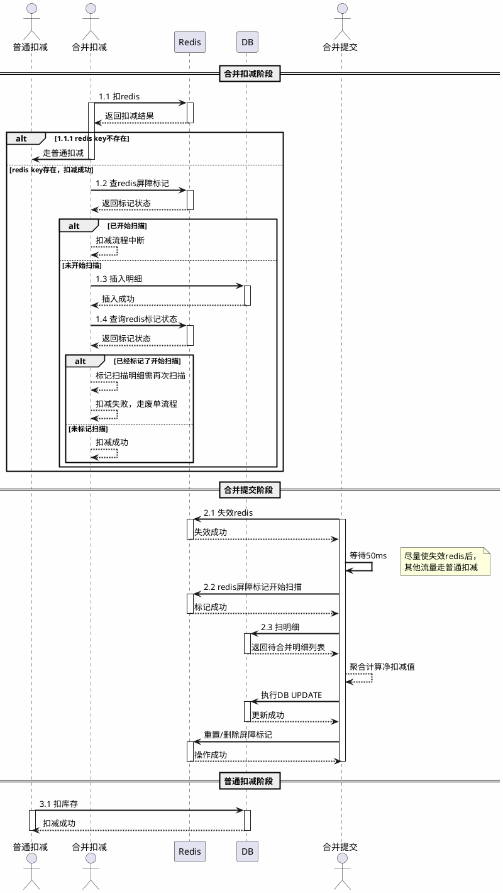

# 库存扣减与合并提交时序图

> 版本 V2.0 — 同步spec.md第六轮评审修复（2026-05-02）

## 一、合并扣减 + 合并提交完整时序



---

## 二、时序说明

### 2.1 参与者定义

| 参与者 | 角色说明 |
|--------|----------|
| **普通扣减** | 传统 DB 直接扣减路径，不走 Redis 分桶 |
| **合并扣减** | 基于 Redis 分桶的扣减路径 |
| **Redis** | 分布式缓存，承担分桶计数和扣减屏障功能 |
| **DB** | MySQL 数据库，存储库存主数据和扣减明细 |
| **合并提交** | 异步调度任务，将 Redis 分散扣减结果汇总到 DB |

### 2.2 合并扣减流程（步骤 1.x）

| 步骤 | 动作 | 说明 |
|------|------|------|
| 1.1 | 扣 Redis | 合并扣减先对 Redis 分桶执行 DECR 操作 |
| 1.1.1 | 降级普通扣减 | 若 Redis Key 不存在（未锁库存或已释放），降级走普通扣减 |
| 1.2 | 查屏障标记 | 扣减成功后检查 Redis 屏障标记，判断是否已开始合并扫描 |
| 1.3 | 插入明细 | 屏障未触发时，向 DB 插入扣减明细（状态=PENDING） |
| 1.4 | 二次确认标记 | 插入明细后再次查询 Redis 标记状态，防止"检查-插入"期间的竞态条件 |

#### 关键竞态处理（步骤 1.4）

```
场景：合并提交在 1.2 和 1.3 之间触发
  - 1.2 检查时：屏障未标记 → 允许插入
  - 合并提交标记屏障 → 开始扫描
  - 1.3 插入明细 → 新明细在扫描期间插入
  - 1.4 二次检查发现已标记 → 该明细被标记为"需再次扫描"
  - 同时本次扣减失败，走废单流程（避免遗漏合并）
```

### 2.3 合并提交流程（步骤 2.x）

| 步骤 | 动作 | 说明 |
|------|------|------|
| 2.1 | 失效 Redis | 删除/失效分桶索引缓存，使后续新请求感知到合并状态 |
| - | 等待 50ms | 给正在进行的扣减请求一个缓冲窗口完成 1.2/1.3/1.4 流程 |
| 2.2 | 标记扫描开始 | 设置 Redis 屏障标记：`inventory:lock:{lockOrderId}:scanning = true` |
| 2.3 | 扫描明细 | 查询 DB 中该 lockOrder 下所有 PENDING 状态的扣减明细 |
| - | 聚合计算 | `净扣减值 = SUM(扣减数量) - SUM(回补数量)` |
| - | DB 原子更新 | `UPDATE inventory SET sq = sq - ?, wq = wq + ? WHERE id = ?` |
| - | 清理屏障 | 合并完成后删除扫描标记，允许新一轮锁库存 |

### 2.4 普通扣减流程（步骤 3.x）

当合并扣减路径不可用时（Redis 失效、屏障触发、分桶耗尽），请求降级到普通扣减路径，直接对 DB 库存行执行扣减操作。

---

## 三、屏障机制详解

### 3.1 为什么需要扣减屏障

合并提交执行期间（2.1 ~ 2.3），如果新的合并扣减请求继续插入明细，会导致：
- 扫描到的明细不完整（漏扫新插入的）
- 合并后仍有 PENDING 明细残留
- 库存数据不一致（sq/wq 与实际明细不匹配）

### 3.2 屏障实现

```
Redis Key: inventory:lock:{lockOrderId}:scanning
Value: "true" (TTL 建议 30s，防止合并任务崩溃导致永久屏障)
```

**屏障检查点**：
- **检查点 1（1.2）**：DECR 成功后立即检查，若已标记则中断扣减流程
- **检查点 2（1.4）**：插入明细后二次检查，若已标记则标记该明细需重扫 + 扣减失败

### 3.3 50ms 等待窗口

```
时间线：
  T0: 合并提交失效 Redis 分桶索引
  T0+50ms: 设置扫描标记
      ↑
      └── 在这 50ms 内正在进行的扣减请求可以完成 1.1~1.4 流程
          但 1.4 会检测到标记已设置，从而标记明细需重扫
```

---

## 四、异常场景映射

| 异常场景 | 时序图中的体现 |
|----------|---------------|
| Redis Lua 扣减成功，DB 明细插入失败 | 1.3 失败 → INCR 回补 Redis（图中未画出补偿） |
| Redis 扣减超时 | 1.1 超时 → 走 1.1.1 普通扣减降级 |
| 合并期间新扣减请求（同一 lockOrder） | 1.2 或 1.4 检测到屏障标记 → 中断/废单 |
| 合并任务重复触发 | 2.2 设置屏障时利用 Redis SET NX 原子性防重 |
| 合并提交 DB 更新失败 | 2.3 事务回滚，屏障标记保留，下次重试 |

---

## 五、状态流转

```
[合并扣减成功]
  1.1 DECR → 1.2 查屏障 → 1.3 插明细 → 1.4 二次确认 → 扣减成功
                                          ↓
                                    若发现已扫描标记
                                          ↓
                                    标记明细"需重扫" + 扣减失败走废单

[合并提交触发]
  2.1 失效分桶 → 等待50ms → 2.2 设屏障 → 2.3 扫明细 → 聚合更新DB → 清屏障
       ↑                                              ↓
       └── 新请求感知索引失效 ─────────────────────── 降级普通扣减
```
